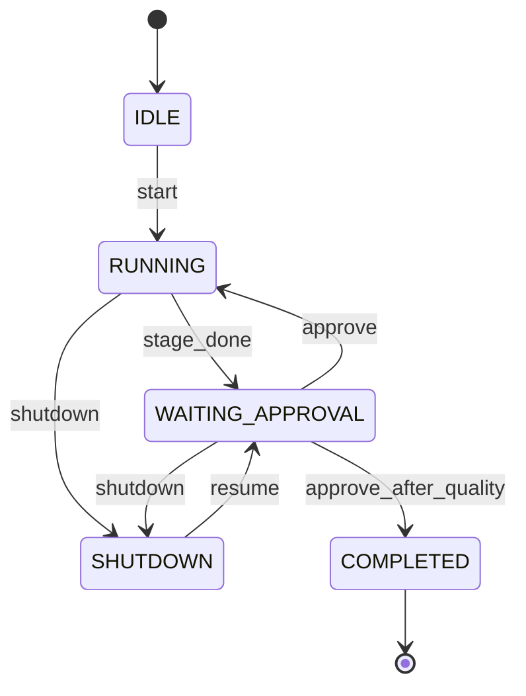

# 系统架构概览（首版）

## 1. 目标

FQAgent 将「芳谦未来」组织流程软件化：**机会发现 → 多角色文档/骨架产出 → 测试与质量门禁 → 真人发布**。首版采用 **安全模式**：每阶段结束 **等待审批**。

## 2. 组件

| 组件 | 说明 |
|------|------|
| `main.py` | CLI：开工、下班、恢复、确认 |
| `Commander` | 状态机：驱动阶段执行与审批门 |
| `Workflow` | 阶段顺序与 Agent 解析 |
| `ApprovalGate` | 将 `WAITING_APPROVAL` 与 `approve()` 动作对接 |
| `MemoryStore` | 事件追加、产物路径约定 |
| `SessionSnapshot` | JSON 快照读写 |
| `OpportunityScout` + `opportunity_rules.yaml` | SaaS 机会评分与排序 |

## 3. 状态机（简化）

说明：`approve_after_quality` 表示在 **QUALITY** 阶段审批通过后进入 **COMPLETED**。

## 4. 阶段顺序

1. `OPPORTUNITY` — OpportunityScout  
2. `PM` — ProjectManager  
3. `REQUIREMENTS` — Requirements  
4. `ARCHITECTURE` — Architect  
5. `DEVELOPMENT` — Developer  
6. `UI` — UIDesigner  
7. `ALGORITHM` — AlgorithmDesigner  
8. `TESTING` — TestEngineer  
9. `QUALITY` — QualityMetrics  

## 5. 数据持久化

- 目录：`memory/history/<project_id>/`
- `snapshot.json`：完整可恢复状态 + `artifacts`
- `events.jsonl`：只追加事件行
- **版本库**：编排快照不等价于 Git；下班前应对仓库内源码与契约文档做 **Git 提交**（见 [`AGENTS.md`](../../AGENTS.md) §4.1）。

详见根目录 [`AGENTS.md`](../../AGENTS.md)。
